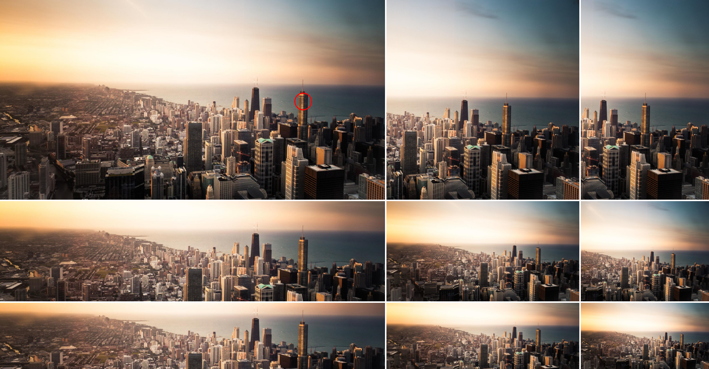

# Intervention Image Focus Filter

Cropping images based on a focal point.



## Requirements
- PHP ^8.1
- [Intervention Image](http://image.intervention.io/)

## Installation
```composer require edwin-luijten/intervention-image-focus```

## Usage
```php
use Intervention\Image\ImageManager;
use EdwinLuijten\InterventionImageFocus\FocusFilter;
...

$manager = new ImageManager();
$image = $manager->make($imageData);

// Valid focal-point values are
// crop-top-left
// crop-top
// crop-top-right
// crop-left
// crop-center
// crop-right
// crop-bottom-left
// crop-bottom
// crop-bottom-right
// x-y percentage 
$image->filter(new FocusFilter(500, 500, '50-50')));

$image->encode('png');
$image->save('test.png');
```